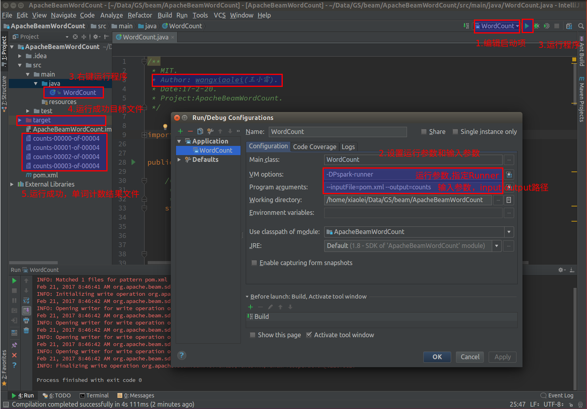

# [Apache Beam WordCount编程实战及源码解读](http://blog.csdn.net/dream_an/article/details/56277784)
# [CSDN博文地址](http://blog.csdn.net/dream_an/article/details/56277784)
# [完整项目地址](https://github.com/wxiaolei/CSDN-CODE/tree/master/Apache-Beam-WordCount)
## 概述：Apache Beam WordCount编程实战及源码解读,并通过intellij IDEA和terminal两种方式调试运行WordCount程序，Apache Beam对大数据的批处理和流处理，提供一套先进的统一的编程模型，并可以运行大数据处理引擎上。（首更时间2017年2月21日）
## 源码目录结构

Apache-Beam-WordCount/
- ApacheBeamWordCount.iml
- pom.xml
- README.md
- src
  - main
    - java
      - WordCount.java
  - resources
  - test
    - java

