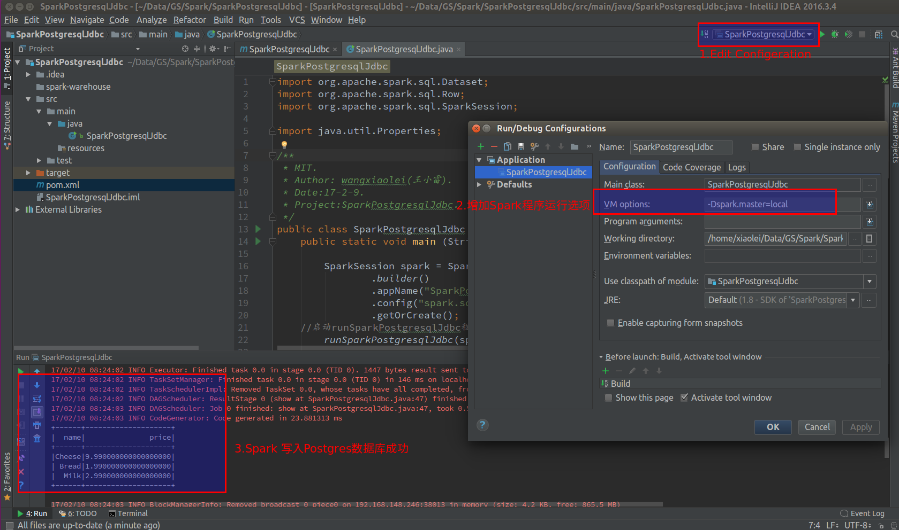

# CSDN-CODE
# [个人CSDN博客](http://blog.csdn.net/dream_an)博文中涉及到的源码整合。
# 王小雷-多面手
# 专注大数据，机器学习的多面手，对新兴的技术与知识充满了好奇与渴望！

 - [Hadoop-Fully-Distributed-完全分布式集群部署](https://github.com/wxiaolei/CSDN-CODE/tree/master/Hadoop-Fully-Distributed-%E5%AE%8C%E5%85%A8%E5%88%86%E5%B8%83%E5%BC%8F%E9%9B%86%E7%BE%A4%E9%83%A8%E7%BD%B2)
   - [超详细从零记录Hadoop2.7.3完全分布式集群部署过程-CSDN博文地址](http://blog.csdn.net/dream_an/article/details/52946840)

   - 超详细从零记录Ubuntu16.04.1 3台服务器上Hadoop2.7.3完全分布式集群部署过程。包含，Ubuntu服务器创建、远程工具连接配置、Ubuntu服务器配置、Hadoop文件配置、Hadoop格式化、启动。（首更时间2016年10月27日）
   - Hadoop-Configure-配置文件
     - core-site.xml
     - hadoop-env.sh
     - hdfs-site.xml
     - mapred-site.xml
     - yarn-site.xml
   - bash-脚本
     - hadoop2.7.3.sh		
     - jdk1.8.sh
   - 增加Spring案例

 - [用windows浏览器打开Linux的Jupyter notebook开发、调试示](http://blog.csdn.net/dream_an/article/details/53333504)
   - [Jupyter-notebook-config远程服务配置](https://github.com/wxiaolei/CSDN-CODE/tree/master/Jupyter-notebook-config%E8%BF%9C%E7%A8%8B%E6%9C%8D%E5%8A%A1%E9%85%8D%E7%BD%AE)
     - .jupyter
       - jupyter_notebook_config.py
       - migrated
       - mycert.pem
       - mykey.key
   配置结果

   [登录Jupyter notebook](http://img.blog.csdn.net/20161125133705174)

   [在Jupyter notebook上spark编程](http://blog.csdn.net/dream_an/article/details/53787183)
 - linux下React Native开发环境搭建，使用Android-studio工具进行React Native整合开发。 参考React Native的官方文档，通过图文详细记录开发过程。可以查看本文档中涉及Github源码。步骤1，2，3来配置React Native开发环境步骤4,5做react-native与Android运行demo整合开发。1.安装Nodejs1.1.下载最新版nod...（首更时间 2016/12/21）
   - React-Native-Android-Studio整合开发+环境配置+官方实例
     - bash
       - nodejs-7.2.sh
   配置结果

   

  -  [spark (java API) 在Intellij IDEA中开发并运行](http://blog.csdn.net/dream_an/article/details/54915894)
    - 概述：Spark 程序开发，调试和运行，intellij idea开发Spark java程序。
    - 分两部分，第一部分基于intellij idea开发Spark实例程序并在intellij IDEA中运行Spark程序.第二部分，将开发程序提交到Spark local或者hadoop YARN集群运行。(首更时间 2017/2/7)
    - 源码文件 SparkJavaIdea.
    - 图1，直接在intellij IDEA(社区版)中开发调试，直接run。

   

    - 图2，直接在intellij IDEA(社区版)中用hadoop YARN模式。

   

   - [Spark jdbc postgresql数据库连接和写入操作源码解读](http://blog.csdn.net/dream_an/article/details/54962464)
      - [CSDN博文地址](http://blog.csdn.net/dream_an)

      - 概述：Spark postgresql jdbc 数据库连接和写入操作源码解读，详细记录了SparkSQL对数据库的操作，通过Java程序，在本地开发和运行。整体为，Spark建立数据库连接，读取数据，将DataFrame数据写入另一个数据库表中。

   - 
