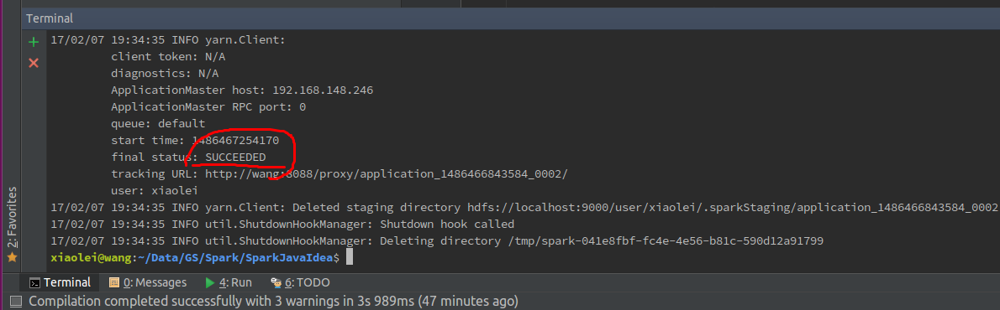
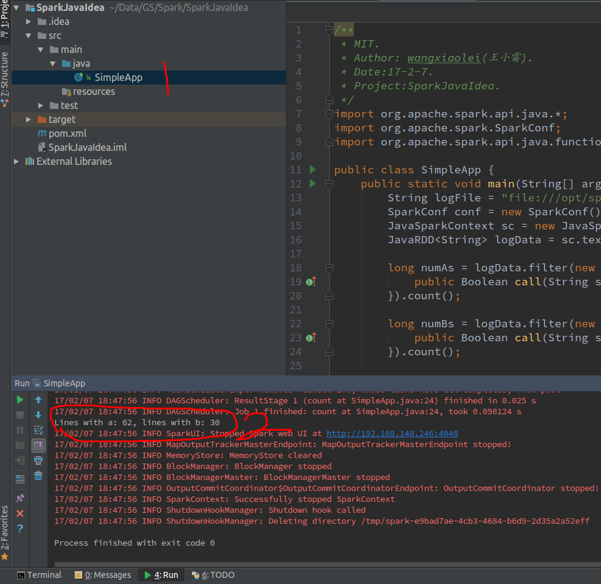

# [spark (java API) 在Intellij IDEA中开发并运行](http://blog.csdn.net/dream_an/article/details/54915894)
# [CSDN博文地址](http://blog.csdn.net/dream_an)

## 概述：Spark 程序开发，调试和运行，intellij idea开发Spark java程序。
## 分两部分，第一部分基于intellij idea开发Spark实例程序并在intellij IDEA中运行Spark程序.第二部分，将开发程序提交到Spark local或者hadoop YARN集群运行。
## 源码文件 SparkJavaIdea
## 图1，直接在intellij IDEA(社区版)中开发调试，直接run。

## 图2，直接在intellij IDEA(社区版)中用hadoop YARN模式。

